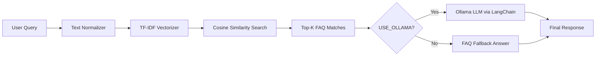
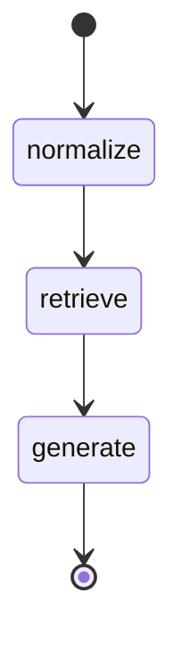

# Jazz Telecom Support RAG Chatbot

AI-powered customer support chatbot built for telecom and JazzCash-style use cases. The system retrieves answers from a curated FAQ knowledge base using **TF-IDF + cosine similarity**, orchestrates the workflow with **LangGraph**, and optionally generates natural-language responses using **Ollama** (local LLM) with a safe FAQ fallback.

Designed as a portfolio project for **AI/ML Engineer** roles, especially in telecom, fintech, and customer-support automation domains.

---

## Quick Start

```bash
cd "Jazz Telecom RAG Chatbot"
python3.11 -m pip install -r requirements.txt
python3.11 scripts/generate_faq_csv.py
python3.11 -m src.build_index
python3.11 -m streamlit run app.py
```

Open: http://localhost:8501

---

## Table of Contents

1. [Overview](#overview)
2. [Key Features](#key-features)
3. [Architecture](#architecture)
4. [How RAG Works in This Project](#how-rag-works-in-this-project)
5. [LangGraph Workflow](#langgraph-workflow)
6. [Tech Stack](#tech-stack)
7. [Project Structure](#project-structure)
8. [Module Reference](#module-reference)
9. [Dataset & CSV Format](#dataset--csv-format)
10. [Installation](#installation)
11. [Usage](#usage)
12. [Streamlit App Pages](#streamlit-app-pages)
13. [Configuration & Environment Variables](#configuration--environment-variables)
14. [Ollama Setup (Optional)](#ollama-setup-optional)
15. [GitHub Setup & Push](#github-setup--push)
16. [Deployment (Streamlit Cloud, Docker, Kubernetes)](#deployment-streamlit-cloud-docker-kubernetes)
17. [Troubleshooting](#troubleshooting)
18. [Example Queries](#example-queries)
19. [Interview Talking Points](#interview-talking-points)
20. [Future Improvements](#future-improvements)
21. [Project Config Files Reference](#project-config-files-reference)
22. [Author](#author)
23. [License](#license)

---

## Overview

Telecom companies like Jazz receive thousands of repetitive support queries every day:

- Balance check
- Package subscription
- JazzCash transfers
- SIM activation
- Internet issues
- Complaint registration

This project demonstrates how to build a **Retrieval-Augmented Generation (RAG)** chatbot that:

1. Searches a structured FAQ knowledge base
2. Retrieves the most relevant support answers
3. Returns a helpful response instantly
4. Optionally rewrites the answer using a local LLM (Ollama)

The solution is lightweight (no GPU required), deployable on Streamlit Cloud, and extendable with Docker and Kubernetes.

---

## Key Features

| Feature | Description |
|---------|-------------|
| **Synthetic FAQ Dataset** | 42 telecom support FAQs in English and Roman Urdu |
| **TF-IDF RAG Retrieval** | Fast, lightweight semantic search without PyTorch |
| **Cosine Similarity Ranking** | Returns top-K most relevant FAQ matches |
| **LangGraph Workflow** | Structured pipeline: normalize → retrieve → generate |
| **Ollama Integration** | Local LLM answer generation via LangChain |
| **FAQ Fallback Mode** | Works without any API key or GPU |
| **JazzCash-Themed UI** | Red/dark Streamlit dashboard (`#dc143c`, `#8b0000`, `#ff4d6d`) |
| **Multi-Page Dashboard** | Chat, FAQ Explorer, Insights, Visualizations |
| **CSV Generator Script** | Prevents CSV parsing errors from unquoted commas |
| **Docker Support** | Containerized deployment |
| **Kubernetes Manifests** | Basic K8s deployment and service files |

---

## Architecture



### High-Level Data Flow

```
telecom_faqs.csv
      │
      ▼
build_index.py  ──►  models/rag_index.joblib
                              │
User Query (Streamlit)        │
      │                       │
      ▼                       ▼
support_graph.py  ──►  rag_pipeline.py  ──►  llm_assistant.py
      │                                              │
      └──────────────── Final Answer ◄───────────────┘
```

### Workflow Steps

1. **Normalize** — Lowercase, trim whitespace, clean the user query
2. **Retrieve** — Convert query to TF-IDF vector and find similar FAQ entries
3. **Generate** — Return best FAQ answer directly, or pass context to Ollama for a natural response

### Why TF-IDF instead of embeddings?

- No PyTorch / CUDA dependency issues
- Fast index build and inference on CPU
- Easy to deploy on Streamlit Cloud
- Good enough for structured FAQ retrieval in a portfolio/demo project

---

## How RAG Works in This Project

### Step 1: Index Building (`src/build_index.py`)

When you run `python3.11 -m src.build_index`:

1. Loads `data/telecom_faqs.csv`
2. Creates a `search_text` field by combining `category + question + answer`
3. Normalizes all text (lowercase, whitespace cleanup)
4. Fits a `TfidfVectorizer` with:
   - `ngram_range=(1, 2)` — unigrams and bigrams
   - `min_df=1` — include all terms
   - `stop_words="english"` — remove common English stop words
5. Saves to `models/rag_index.joblib`:
   - `vectorizer` — fitted TF-IDF model
   - `matrix` — document-term matrix for all FAQs
   - `records` — original FAQ rows

### Step 2: Query Retrieval (`src/rag_pipeline.py`)

When a user asks a question:

1. Normalize the query text
2. Transform query into TF-IDF vector using saved vectorizer
3. Compute cosine similarity against all FAQ vectors
4. Return top-K matches with confidence scores

### Step 3: Answer Generation (`src/llm_assistant.py`)

| Mode | When | Behavior |
|------|------|----------|
| **FAQ Fallback** | `USE_OLLAMA=false` | Returns best matching FAQ question + answer |
| **Ollama LLM** | `USE_OLLAMA=true` | Sends retrieved FAQ context to Ollama via LangChain |

If Ollama fails or is unavailable, the system automatically falls back to FAQ mode.

---

## LangGraph Workflow

**File:** `src/support_graph.py`



### State Schema

```python
class SupportState(TypedDict):
    query: str              # Original user question
    normalized_query: str   # Cleaned query
    matches: list           # Top-K retrieved FAQs
    answer: str             # Final response
```

### Nodes

| Node | Function | Description |
|------|----------|-------------|
| `normalize` | `normalize_node` | Cleans and lowercases the query |
| `retrieve` | `retrieve_node` | Runs TF-IDF similarity search |
| `generate` | `generate_node` | Produces final answer via Ollama or fallback |

### Python Usage

```python
from src.support_graph import run_support_workflow

result = run_support_workflow("How do I check my balance?")
print(result["answer"])
print(result["matches"])
```

---

## Tech Stack

| Layer | Technology | Purpose |
|-------|------------|---------|
| Language | Python 3.11 | Core runtime |
| Frontend | Streamlit | Interactive web dashboard |
| Retrieval | scikit-learn (TF-IDF) | Text vectorization |
| Vector Search | Cosine Similarity | FAQ ranking |
| Orchestration | LangGraph | Workflow state machine |
| LLM Integration | LangChain + Ollama | Optional answer generation |
| Data | Pandas, CSV | FAQ storage and loading |
| Serialization | joblib | Index persistence |
| Visualization | Plotly | Charts and graphs |
| Deployment | Docker, Kubernetes, Streamlit Cloud | Production hosting |

---

## Project Structure

```
Jazz Telecom RAG Chatbot/
├── app.py                      # Streamlit dashboard (main entry point)
├── requirements.txt            # Python dependencies
├── .env.example                # Environment variable template
├── .gitignore                  # Git ignore rules
├── Dockerfile                  # Docker image definition
├── README.md                   # This file — complete project documentation
│
├── data/
│   └── telecom_faqs.csv        # FAQ knowledge base (42 rows)
│
├── models/
│   └── rag_index.joblib        # Saved TF-IDF index (generated)
│
├── scripts/
│   └── generate_faq_csv.py     # Generates properly quoted CSV
│
├── src/
│   ├── __init__.py
│   ├── config.py               # Paths and environment settings
│   ├── text_normalizer.py      # Query preprocessing
│   ├── build_index.py          # Builds and saves TF-IDF index
│   ├── rag_pipeline.py         # Retrieval logic
│   ├── llm_assistant.py        # Ollama / fallback answer generation
│   └── support_graph.py        # LangGraph workflow
│
└── k8s/
    ├── deployment.yaml         # Kubernetes deployment
    └── service.yaml            # Kubernetes service
```

---

## Module Reference

### `src/config.py`

| Setting | Env Variable | Default |
|---------|--------------|---------|
| FAQ data path | — | `data/telecom_faqs.csv` |
| Index path | — | `models/rag_index.joblib` |
| Top-K results | `TOP_K` | `3` |
| Use Ollama | `USE_OLLAMA` | `false` |
| Ollama URL | `OLLAMA_BASE_URL` | `http://localhost:11434` |
| Ollama model | `OLLAMA_MODEL` | `llama3.2` |

### `src/text_normalizer.py`
- Lowercases input text
- Strips leading/trailing whitespace
- Collapses multiple spaces into one

### `src/build_index.py`
- Loads and validates CSV
- Builds TF-IDF index
- Saves serialized index to disk
- **Run:** `python3.11 -m src.build_index`

### `src/rag_pipeline.py`
- Loads saved index from `rag_index.joblib`
- `RAGPipeline.retrieve(query)` returns ranked `RetrievedFAQ` objects
- Each result includes: category, language, question, answer, score

### `src/llm_assistant.py`
- `generate_answer(query, matches)` produces the final response
- Formats retrieved FAQs as LLM context
- Handles Ollama errors gracefully with FAQ fallback

### `src/support_graph.py`
- Compiles LangGraph workflow
- `run_support_workflow(query)` is the main API used by Streamlit

### `scripts/generate_faq_csv.py`
- Generates `data/telecom_faqs.csv` with proper `QUOTE_ALL` CSV quoting
- Prevents `pandas.errors.ParserError` from commas inside answers
- **Run:** `python3.11 scripts/generate_faq_csv.py`

### `app.py`
- Streamlit multi-page dashboard
- JazzCash red/dark theme
- Four pages: Chat, FAQ Explorer, Insights, Visualizations

---

## Dataset & CSV Format

**File:** `data/telecom_faqs.csv`

### Schema

| Column | Type | Description |
|--------|------|-------------|
| `category` | string | FAQ topic |
| `language` | string | `English` or `Roman Urdu` |
| `question` | string | Customer question |
| `answer` | string | Official support answer |

### Categories (10) — 42 FAQs total

| Category | FAQs | Example Question |
|----------|------|------------------|
| Balance | 4 | How do I check my Jazz balance? |
| Packages | 4 | How do I subscribe to a Jazz package? |
| Recharge | 4 | How can I recharge my Jazz number? |
| JazzCash | 6 | How do I create a JazzCash account? |
| SIM | 4 | How do I activate a new Jazz SIM? |
| Internet | 4 | My mobile internet is not working |
| Complaints | 4 | How do I register a complaint? |
| App Login | 4 | I cannot log in to Jazz World app |
| Billing | 4 | How do I pay my postpaid bill? |
| Offers | 4 | How do I find current Jazz offers? |

**Languages:** 21 English + 21 Roman Urdu

### Correct CSV Format (required)

Every field must be wrapped in double quotes:

```csv
"category","language","question","answer"
"Balance","English","How do I check my Jazz balance?","Dial *111# from your Jazz number or open the Jazz World app and tap Balance on the home screen."
"Balance","Roman Urdu","Balance kaise check karun?","Apne Jazz number se *111# dial karein ya Jazz World app khol kar home screen par Balance par tap karein."
"Packages","English","How do I subscribe to a Jazz package?","Open the Jazz World app, go to Packages, choose your preferred bundle, and tap Subscribe. You can also dial the package code from the Jazz website."
```

### Wrong CSV Format (causes parse error)

```csv
Packages,English,How do I subscribe?,Open the app, go to Packages, tap Subscribe
```

This produces:
```
pandas.errors.ParserError: Expected 4 fields in line 6, saw 7
```

### Regenerate the dataset

```bash
python3.11 scripts/generate_faq_csv.py
python3.11 -m src.build_index
```

---

## Installation

### Prerequisites

- Python 3.11 (use `python3.11` on Mac — `python` may not exist)
- pip
- Git (optional)
- Ollama (optional, for LLM generation)
- Docker Desktop (optional, for container/K8s deployment)

### Step 1 — Install dependencies

```bash
cd "Jazz Telecom RAG Chatbot"
python3.11 -m pip install -r requirements.txt
```

### Step 2 — Create environment file

```bash
cp .env.example .env
```

### Step 3 — Generate FAQ dataset

```bash
python3.11 scripts/generate_faq_csv.py
```

### Step 4 — Build the RAG index

```bash
python3.11 -m src.build_index
```

Expected output:

```
Loading FAQ dataset...
Loaded 42 FAQ rows
Building TF-IDF index...
Saved index to models/rag_index.joblib
```

### Step 5 — Run the app

```bash
python3.11 -m streamlit run app.py
```

Open: http://localhost:8501

---

## Usage

### Rebuild index after FAQ changes

```bash
python3.11 -m src.build_index
```

### Run without Ollama (recommended first)

```bash
export USE_OLLAMA=false
python3.11 -m streamlit run app.py
```

### Run with Ollama (local LLM)

```bash
# Terminal 1
ollama serve
ollama pull llama3.2

# Terminal 2
export USE_OLLAMA=true
export OLLAMA_MODEL=llama3.2
python3.11 -m streamlit run app.py
```

### Test retrieval from Python

```python
from src.rag_pipeline import RAGPipeline

pipeline = RAGPipeline()
matches = pipeline.retrieve("balance kaise check karun")
for m in matches:
    print(f"{m.score:.2f} | {m.question}")
```

### Test full workflow from Python

```python
from src.support_graph import run_support_workflow

result = run_support_workflow("JazzCash MPIN bhool gaya")
print(result["answer"])
```

---

## Streamlit App Pages

### 1. AI Support Chat
- Chat-style interface for customer queries
- Maintains conversation history in session state
- Shows retrieved FAQ matches with confidence scores in an expander
- Supports English and Roman Urdu questions
- Displays whether Ollama is enabled or FAQ fallback is active

### 2. FAQ Explorer
- Browse all 42 FAQs in a searchable table
- Filter by category (Balance, Packages, JazzCash, etc.)
- Filter by language (English, Roman Urdu)
- Keyword search across all columns

### 3. Knowledge Insights
- Total FAQs, Categories, and Languages metrics
- Bar chart showing FAQ distribution per category

### 4. Visualization Gallery
- Pie chart: FAQ distribution by category (red color scheme)
- Bar chart: FAQs by language
- Built with Plotly for interactive charts

### UI Theme Colors

| Color | Hex | Usage |
|-------|-----|-------|
| Jazz Red | `#dc143c` | Buttons, accents |
| Dark Red | `#8b0000` | Header gradient |
| Light Red | `#ff4d6d` | Header gradient |
| Dark BG | `#1a1a1a` | App background |

---

## Configuration & Environment Variables

| Variable | Default | Description |
|----------|---------|-------------|
| `USE_OLLAMA` | `false` | Enable Ollama LLM answer generation |
| `OLLAMA_BASE_URL` | `http://localhost:11434` | Ollama API base URL |
| `OLLAMA_MODEL` | `llama3.2` | Ollama model name |
| `TOP_K` | `3` | Number of FAQ matches to retrieve |

Set in `.env`, shell exports, Docker `-e` flags, or Streamlit secrets.

### Streamlit Cloud Secrets

Create `.streamlit/secrets.toml` locally (do not commit) or add in Streamlit Cloud dashboard:

```toml
USE_OLLAMA = "false"
TOP_K = "3"
```

---

## Ollama Setup (Optional)

### Install
Download from: https://ollama.com

### Pull model and start server

```bash
ollama pull llama3.2
ollama serve
```

### Verify Ollama is running

```bash
ollama list
curl http://localhost:11434/api/tags
```

### Enable in app

```bash
export USE_OLLAMA=true
export OLLAMA_MODEL=llama3.2
python3.11 -m streamlit run app.py
```

### Docker + Ollama on Mac

```bash
docker run -p 8501:8501 \
  -e USE_OLLAMA=true \
  -e OLLAMA_BASE_URL=http://host.docker.internal:11434 \
  -e OLLAMA_MODEL=llama3.2 \
  jazz-rag-chatbot
```

If Ollama is unavailable, the app automatically falls back to the best FAQ answer.

---

## GitHub Setup & Push

### Initialize and push

```bash
cd "Jazz Telecom RAG Chatbot"
git init
git add .
git commit -m "Initial commit: Jazz Telecom RAG Chatbot"
git branch -M main
git remote add origin https://github.com/ham02zah/jazz-telecom-rag-chatbot.git
git push -u origin main
```

### Files that MUST be committed

| File | Why |
|------|-----|
| `data/telecom_faqs.csv` | FAQ knowledge base |
| `models/rag_index.joblib` | Pre-built index for Streamlit Cloud |
| `app.py` | Streamlit entry point |
| `requirements.txt` | Dependencies |
| `src/` | Application code |

### Force-add index if gitignore blocks it

```bash
git add -f models/rag_index.joblib
```

### Rebuild and push after FAQ updates

```bash
python3.11 -m src.build_index
git add data/telecom_faqs.csv models/rag_index.joblib
git commit -m "Update FAQ dataset and rebuild index"
git push
```

### Git push rejected (remote has files)

```bash
git pull origin main --rebase
git push origin main
```

---

## Deployment (Streamlit Cloud, Docker, Kubernetes)

### Streamlit Cloud

1. Push project to GitHub (see above)
2. Go to https://share.streamlit.io
3. Click **New app** → connect your GitHub repo
4. Set **Main file path:** `app.py`
5. Add secrets: `USE_OLLAMA = "false"` and `TOP_K = "3"`
6. Click **Deploy**

> Use `USE_OLLAMA=false` on Streamlit Cloud. FAQ fallback works without any external API.

### Docker

```bash
docker build -t jazz-rag-chatbot .
docker run -p 8501:8501 -e USE_OLLAMA=false jazz-rag-chatbot
```

Open: http://localhost:8501

### Kubernetes

```bash
kubectl config use-context docker-desktop
docker build -t jazz-rag-chatbot:latest .
kubectl apply -f k8s/deployment.yaml
kubectl apply -f k8s/service.yaml
kubectl get pods
kubectl get services
kubectl port-forward service/jazz-rag-chatbot 8501:80
```

Open: http://localhost:8501

---

## Troubleshooting

### CSV parse error

```
pandas.errors.ParserError: Expected 4 fields in line 6, saw 7
```

**Cause:** Commas inside FAQ answers without proper quoting.

**Fix:**
```bash
python3.11 scripts/generate_faq_csv.py
python3.11 -m src.build_index
```

### RAG index not found

```
RAG index not found. Run: python3.11 -m src.build_index
```

**Fix:**
```bash
python3.11 -m src.build_index
```

### Ollama connection failed

1. Start Ollama: `ollama serve`
2. Verify model: `ollama list`
3. Test API: `curl http://localhost:11434/api/tags`
4. Or disable: `export USE_OLLAMA=false`

### Streamlit Cloud: app loads but chat does not work

1. Confirm `models/rag_index.joblib` is committed to GitHub
2. Check `.gitignore` has `!models/rag_index.joblib`
3. Force add: `git add -f models/rag_index.joblib`
4. Rebuild index locally and push again

### `python` command not found (Mac)

```bash
python3.11 -m streamlit run app.py
```

### NumPy / PyTorch conflicts

This project avoids PyTorch and `sentence-transformers`. TF-IDF runs on CPU with scikit-learn only.

---

## Example Queries

| Query | Language | Expected Category |
|-------|----------|-------------------|
| How do I check my balance? | English | Balance |
| Balance kaise check karun? | Roman Urdu | Balance |
| How to subscribe to a package? | English | Packages |
| Jazz package kaise subscribe karun? | Roman Urdu | Packages |
| JazzCash MPIN bhool gaya | Roman Urdu | JazzCash |
| How do I send money via JazzCash? | English | JazzCash |
| Internet not working | English | Internet |
| Mobile internet kaam nahi kar raha | Roman Urdu | Internet |
| How to register a complaint? | English | Complaints |
| Postpaid bill payment | English | Billing |
| Current Jazz offers | English | Offers |
| Naya SIM activate kaise karun? | Roman Urdu | SIM |

---

## Interview Talking Points

1. **Problem:** Telecom support teams handle thousands of repetitive queries daily. Manual handling is slow and expensive.
2. **Solution:** Built a RAG chatbot that retrieves answers from a structured FAQ knowledge base before generating any response.
3. **Retrieval-First Design:** Reduces hallucination risk by grounding answers in verified FAQ content.
4. **RAG Pipeline:** User query → text normalization → TF-IDF vectorization → cosine similarity → top-K FAQ retrieval → answer generation.
5. **LangGraph Orchestration:** Separated workflow into modular nodes (normalize, retrieve, generate) using a stateful graph.
6. **Graceful Fallback:** If Ollama is unavailable, returns best FAQ match with confidence score. No API key required.
7. **Multilingual Support:** Dataset includes Roman Urdu FAQs for Pakistani telecom users.
8. **Deployment Flexibility:** Runs locally, on Streamlit Cloud, in Docker, and on Kubernetes.
9. **Engineering Trade-off:** Chose TF-IDF over embedding models to avoid PyTorch/CUDA dependencies.
10. **Production Considerations:** CSV validation, index pre-building, environment-based configuration, LLM error handling.

---

## Future Improvements

- [ ] Replace TF-IDF with `sentence-transformers` embeddings
- [ ] Add ChromaDB or FAISS vector store
- [ ] Add chat history and session memory across turns
- [ ] Add feedback buttons (helpful / not helpful)
- [ ] Add admin page to upload and manage FAQs
- [ ] Add Whisper integration for voice-based support queries
- [ ] Add FastAPI REST backend for mobile app integration
- [ ] Add evaluation metrics: retrieval accuracy, MRR, hit rate@K
- [ ] Add query logging and analytics dashboard
- [ ] Support Urdu script (not just Roman Urdu)

---

## Project Config Files Reference

All config files used by this project are documented here so you do not need to look elsewhere.

### `requirements.txt`

```
streamlit>=1.32.0
pandas>=2.0.0
scikit-learn>=1.4.0
joblib>=1.3.0
plotly>=5.18.0
langgraph>=0.2.0
langchain-core>=0.3.0
langchain-ollama>=0.2.0
python-dotenv>=1.0.0
```

### `.env.example`

```
USE_OLLAMA=false
OLLAMA_BASE_URL=http://localhost:11434
OLLAMA_MODEL=llama3.2
TOP_K=3
```

### `.gitignore`

```
__pycache__/
*.py[cod]
.env
.venv/
venv/
.DS_Store
.streamlit/secrets.toml
models/*
!models/rag_index.joblib
```

### `Dockerfile`

```dockerfile
FROM python:3.11-slim

WORKDIR /app

COPY requirements.txt .
RUN pip install --no-cache-dir -r requirements.txt

COPY . .

RUN python -m scripts.generate_faq_csv && python -m src.build_index

EXPOSE 8501

CMD ["streamlit", "run", "app.py", "--server.address=0.0.0.0", "--server.port=8501"]
```

### `k8s/deployment.yaml`

```yaml
apiVersion: apps/v1
kind: Deployment
metadata:
  name: jazz-rag-chatbot
spec:
  replicas: 1
  selector:
    matchLabels:
      app: jazz-rag-chatbot
  template:
    metadata:
      labels:
        app: jazz-rag-chatbot
    spec:
      containers:
        - name: jazz-rag-chatbot
          image: jazz-rag-chatbot:latest
          ports:
            - containerPort: 8501
          env:
            - name: USE_OLLAMA
              value: "false"
```

### `k8s/service.yaml`

```yaml
apiVersion: v1
kind: Service
metadata:
  name: jazz-rag-chatbot
spec:
  type: LoadBalancer
  selector:
    app: jazz-rag-chatbot
  ports:
    - port: 80
      targetPort: 8501
```

---

## Author

**Hamzah** — AI/ML Engineer Portfolio Project

- GitHub: https://github.com/ham02zah
- Focus: Machine Learning, RAG, LLMs, Telecom AI, Streamlit Apps

---

## License

This project is for educational and portfolio purposes.